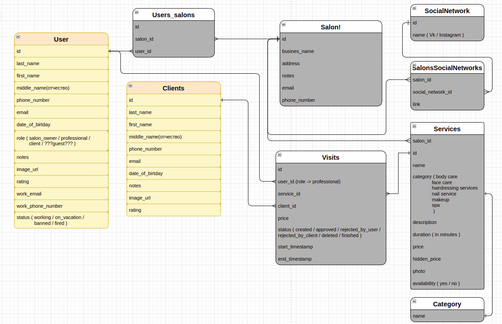

# Online booking system for the beauty industry

```
The API should allow salon visitors to book services with professionals and professionals to conduct business.
```

## Main entities
### User:
```
  * the owner of the salon;
      professional :
  * performing the service;
```
### Customer:
```
  * using the service;
```
### Salon:
```
  * represents one business;
```
### Visit

### Service
### Category

---
## Opportunities for the owner and professional of the salon

### Salon owner:
```
  * All the features of a professional
  * Editing salon
  * Adding users to the salon
  * Editing a salon user
  * Deleting a user from the salon
  * Adding a service
  * Editing a service
  * Deleting a service
  * Business report request
```
### Salon Professional:
```
  * Arranging a client visit
  * Adding clients
  * Editing clients
  * Deleting clients
```
### Unregistered user:
```
  * Booking a visit, indicating your data - the system
      finds an existing or creates a new client;
  * View available specialists and their time;
```
---

## Functional
```
* Salon owner with the help of professionals can lead  business.

* Clients do not register on the site, as unregistered users can
   create visit.

* A visit can also be created by salon users.

* Integration with one of the Geocoding APIs to get accurate visiting
   address coordinates.

* Reminder to professionals performing a service in X minutes
   before the start of the visit. X must be customizable in the cabin.

* Reminder to customers that they will start soon
   visit 1 hour before the start.

* Full text search via ElasticSearch by name and/or
   description of the service for the client.
```
---

## Database Schema



- [db_schema](https://app.diagrams.net/?src=about#G1TZqgMmhVC1gXIbvascfi6lO8NxzPzST0)

---


### To run:

```rb
cp config/database.yml.example config/database.yml
```

```rb
cp config/application.yml.example config/application.yml
```

```rb
bundle exec rails s
```

## Our team


---

- [@Suleyman Gek62](https://github.com/GEK62)
- [@Tehanov Anton / TehanovAnton](https://github.com/TehanovAnton)
- [@Valeriya Petrova / valeriyapetrova](https://github.com/valeriyapetrova)
- [@Vitaliy Goylo / Vgoylo ](https://github.com/Vgoylo)

---